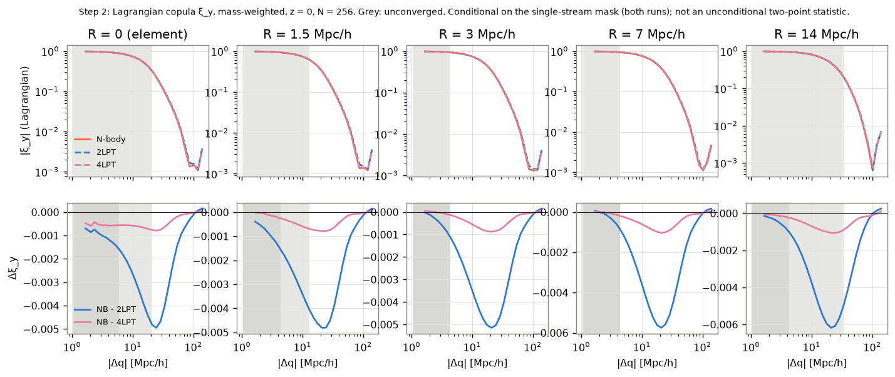
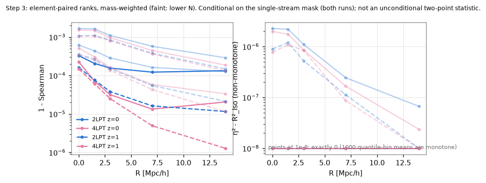
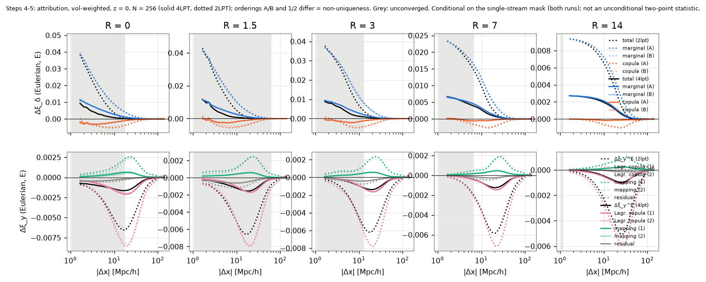

# LPT vs N-body beyond the one-point PDF: rank-Gaussianized (copula) two-point statistics on the phase-space sheet

> **Every statistic in this report is conditional on the single-stream mask** (both runs).
> None of them is an unconditional two-point statistic.

Companion to the one-point study in [../README.md](../README.md), which found 2LPT PDFs too
narrow in both tails and 4LPT within about 1%. The question here is whether LPT also gets the
**spatial correlations** wrong once the one-point PDF has been removed. If it does, the next
question is whether the error lives in the Lagrangian field or in the displacement mapping.
Reproduction is covered in [README.md](README.md).

## Summary

Setting: the same fixed-amplitude ICs as the one-point study (L = 300 Mpc/h, top-hat
R_F = 14 Mpc/h), z = 1 and 0, and single-stream elements only (99.2% of the mass at z = 0).

1. **Once the PDF is removed, 2LPT has a small but converged two-point error. 4LPT removes
   75–95% of it.**
   - The rank-Gaussianized Lagrangian correlation ξ_y of 2LPT exceeds N-body's by
     5–6 × 10⁻³ at |Δq| ≈ 20–30 Mpc/h at z = 0 (−1.5% of ξ_y mass-weighted, −3%
     volume-weighted), and by 2 × 10⁻³ at z = 1.
   - For 4LPT the same difference is 1.0–1.4 × 10⁻³ at z = 0 and ≈ 1 × 10⁻⁴ at z = 1. At z = 1
     that is at the noise floor.
   - The sign and scale are nearly independent of the smoothing R (0–14 Mpc/h), so the error
     is carried by the large-scale Lagrangian field, not by small-scale structure.
2. **Element by element, the LPT and N-body ranks are the same monotone function to better
   than 10⁻³.**
   - 1 − Spearman ≤ 3 × 10⁻⁴ at N = 256 in every case.
   - The part of the paired relation that is not monotone is exactly zero at the resolution
     of the estimator (1000 quantile bins) for N ≥ 128.
   - 1 − Spearman keeps falling with particle number and *rises* with sheet refinement. It
     therefore measures N-body small-scale discreteness, not LPT, and is **not converged**.
   - The only exception is 2LPT at z = 0, R ≥ 7 Mpc/h: there 1 − ρ ≈ 1.3 × 10⁻⁴ is stable,
     a genuine 2LPT rank error.
3. **In Eulerian space the ξ_δ difference between N-body and LPT comes almost entirely from
   the one-point marginal** (volume-weighted, converged, at r ≈ 10 Mpc/h).
   - Replacing the LPT marginal with the N-body one reproduces 108–121% of
     Δξ_δ = ξ_δ[NB] − ξ_δ[LPT] at z = 0 for R ≥ 7 Mpc/h, 155–163% at R = 3 Mpc/h and about
     220% at R = 0. The copula part is of opposite sign.
   - At z = 1 the marginal share is 106–112%.
   - The two orderings of the decomposition agree to ≤ 0.12, so the non-uniqueness is small
     here.
   - In Gaussianized-score space, the small copula difference that does exist is carried by
     the **Lagrangian copula** (93–120% of it). The displacement mapping contributes −2% to
     −35% and the unexplained residual 1–31%.
4. **Mass-weighted Eulerian statistics are not converged in particle number** (below). They
   are reported but not interpreted.

## Setup

| item | value |
|---|---|
| ICs | fixed amplitudes (Angulo & Pontzen), phase seed 1, real-space top-hat R_F = 14 Mpc/h, L = 300 Mpc/h, Planck18 |
| LPT | DiscoDJNative: 2LPT and 4LPT (exact growth through 3rd order, EdS 4th) |
| N-body | DiscoDJNative `run_nbody` (port of DISCO-DJ, parity 3e-14): BullFrog, 64 steps, PM mesh 2N, 4th-order gradient, CIC; 2LPT ICs at a = 0.04 (z = 24) |
| loadings | N = 64, 128, 256 particles per dimension (spacing 4.7 / 2.3 / 1.2 Mpc/h) |
| sheet | 6 Kuhn tetrahedra per Lagrangian cube, exact volumes; refinement levels 0 and 1 (Fourier-interpolated displacement) |
| mask M | element not inverted AND centroid stream count exactly 1, **in both runs** |
| values | R = 0: element density Vq/V; R > 0: top-hat (R) smoothed sheet density (512³ mesh) at the centroid |
| Gaussianization | y = Φ⁻¹((rank − ½)/N) over M per run, z and R; mass (equal element weights) and volume (exact V_e) versions, never mixed; tie-break jitter seed 11 |
| R | 0, 1.5, 3, 7, 14 Mpc/h (below, near and above the interparticle spacing) |

## Step 1: validation (all pass/fail tests passed)

Details are in `results/step1_tables.md` and `figures/step1_*`.

| test | result |
|---|---|
| **1a** z_init element by element (Pearson ≥ 0.999, rms Δy ≤ 0.05) | pass at every N, level, R and weighting. 4LPT vs N-body: 1 − r ≈ 1e-9, rms Δy ≈ 4e-5. **2LPT vs N-body is identical by construction**, because the N-body starts from 2LPT at z = 24, so 1a only exercises the bookkeeping for 2LPT. |
| **1b** monotone transforms (log, cube, −1/ρ, asinh), max \|Δξ\| ≤ 1e-10 | pass: Δξ = 0 exactly and y bit-identical everywhere |
| **1c** noise floors | tie-seed floor 0: values are continuous and ties essentially never occur (one tie in the whole N = 256, z = 24 set). Refinement floor on ξ_y itself: 2.5e-2 (N = 64) and 1.0e-2 (N = 128). |
| **1d** Zel'dovich marginal vs Doroshkevich \| det J > 0 | **first run failed**, second passed (below) |

**The test 1d episode.**
- *First run.* With 8 band realisations, the z = 0 mass-weighted 90% quantile of the band
  mean sat 3.75σ below theory (−0.9%) and the test failed.
- *Diagnosis, no tuning.*
  - An independent numpy reimplementation reproduced the pipeline's quantiles (0.4151 vs
    0.4147).
  - σ matched theory to 1e-4 once the tet-lattice smoothing (−0.14%) was included.
  - The tidal tensor was isotropic (0.2015σ² vs 3/15 for diagonals, 0.066σ² vs 1/15 for
    off-diagonals).
  - Excess kurtosis across seeds was −0.009 ± 0.027.
  - The criterion itself (a 3σ cut on 44 correlated quantiles, each the mean of 8 seeds) has a
    30–60% false-alarm rate under the null.
- *Rerun.* On the user's instruction the band was enlarged to 32 realisations (seeds 101–132)
  **with the criterion unchanged**. The offset fell from −0.0039 to −0.0018, as noise would,
  and every quantile passed (max 2.76σ). The diagnostic is kept in `diag_test_d.py`.

## Deviations from the protocol and changes made after seeing data

In chronological order:

1. **Test 1d band size** 8 → 32 seeds, criterion unchanged (above).
2. **N = 256 at refinement level 1 was dropped.** Its 1.3 × 10⁸ elements need about 20 GB of
   products and more than 15 GB of RAM. Refinement convergence is measured at N = 128 (and
   64), and headline numbers come from N = 256, level 0. *Assumption, stated:* the refinement
   error at N = 256 is no larger than at N = 128.
3. **Eulerian analysis mesh 512³ → 256³** (spacing 1.17 Mpc/h). The 512³ Eulerian phase ran
   out of memory. Eulerian R = 1.5 Mpc/h is therefore mesh-limited. The Lagrangian R > 0
   values still use the 512³ mesh.
4. **Convergence criterion revised after seeing the z = 0 level-0 runs** (before any
   refinement result).
   - *The pre-set test was vacuous.* It required each run's statistic to agree across
     resolution within 2%|S| + 0.002 (ξ), 0.01 (r(k)) and 0.005 (scalars). The LPT–N-body
     differences are 10⁻³ in ξ_y and 10⁻⁴ in 1 − ρ, far below those tolerances, so the test
     could not detect non-convergence of the quantity of interest.
   - *New test.* Convergence now acts on the **differences** D = S[NB] − S[LPT] (for scalars,
     on 1 − value). A bin is converged if D changes between N = 256 and 128 (level 0) and
     between level 1 and 0 (N = 128) by no more than 25% of the local amplitude
     max_{r/2 ≤ r' ≤ 2r}|D| plus a measured noise floor. The noise floor is the largest such
     change at r ≥ 70 Mpc/h (k ≤ 2π/70), where D carries no signal.
   - The local amplitude and the measured noise floor were added after the first version of
     the new test failed trivially at zero crossings of D and in noise-dominated large-r bins.
   - The converged range is the contiguous range from large scales down. Empty bins are
     skipped, and bins that exist only at the higher resolution count as unconverged.
   - The pre-set result is still reported (tables: "pre-set").

## Step 2: Lagrangian copula

*Figure 1.* Rank-Gaussianized ξ_y in Lagrangian space, N-body vs 2LPT and 4LPT (top), and their
difference (bottom), mass-weighted, z = 0, N = 256. Grey: not converged. **Conditional on the
single-stream mask (both runs); not an unconditional two-point statistic.** Volume-weighted and
z = 1 versions: `figures/steps_2_xi_{vol,mass}_z{0,1}.png`.

Difference D = ξ_y[NB] − ξ_y[LPT] at R = 7 Mpc/h (converged at |Δq| ≥ 4.3 Mpc/h in all four
cases):

| z | weighting | 2LPT: min D (r) | rel. to ξ_y | 4LPT: min D (r) | rel. to ξ_y | D at 4.3 Mpc/h (2LPT / 4LPT) |
|---|---|---|---|---|---|---|
| 0 | mass | −5.7e-3 (21) | −1.5% | −1.0e-3 (21) | −0.27% | −8.3e-4 / −1.9e-4 |
| 0 | volume | −5.7e-3 (29) | −3.1% | −1.4e-3 (24) | −0.52% | +2.1e-2 / +6.2e-3 |
| 1 | mass | −2.0e-3 (24) | −0.70% | −1.0e-4 (24) | −0.04% | −2.4e-4 / −1.5e-5 |
| 1 | volume | −2.1e-3 (24) | −0.76% | −1.6e-4 (24) | −0.06% | +3.8e-3 / +4.8e-4 |

What the table shows:
- **At 20–30 Mpc/h, LPT copulas are slightly too correlated.** This is on the scale of the
  filter (R_F = 14, so separations of order 2R_F).
- **Volume-weighted, at small separations, they are not correlated enough.** The
  volume-weighted difference changes sign near 15 Mpc/h.
- **The error shrinks with LPT order and toward earlier times.** Going from 2LPT to 4LPT removes
  75–82% of it at z = 0 and 92–95% at z = 1.
- **The same pattern holds at every R** (all rows in `results/steps_tables.md`, Step 2).
  Smoothing does not change it.

**Cross-correlation r(k)** of the LPT and N-body score fields (converged range):
- *z = 0, 2LPT:* the largest 1 − r(k) is 1.5e-2 (mass) and 3e-3 (volume), at k ≲ 0.3–0.7 h/Mpc.
- *z = 0, 4LPT:* ≤ 9e-5, but converged only at k ≲ 0.16.
- *z = 1:* ≤ 6e-5 (2LPT) and ≤ 1e-6 (4LPT).

For 4LPT the score fields are therefore phase-aligned to ≲ 10⁻⁴. For 2LPT at z = 0 the
decorrelation, up to 1.5% in the mass-weighted case at k ≈ 0.3–0.7 h/Mpc, is comparable to the
1.5–3% amplitude difference of ξ_y.

## Step 3: element-paired ranks

*Figure 2.* Left: 1 − Spearman between the LPT and N-body scores of the same element. Right: the
part of the paired relation that is not monotone, η² − R²_iso (quantile-binned correlation ratio
minus isotonic R²). Mass-weighted; faint lines are lower N. **Conditional on the single-stream
mask (both runs); not an unconditional two-point statistic.**

1 − ρ_S (mass-weighted), N = 64 / 128 / 256 at level 0, and N = 128 at level 1:

| z | pair | R = 0 | R = 3 | R = 7 | R = 14 |
|---|---|---|---|---|---|
| 0 | 2LPT | 1.7e-3 / 6.2e-4 / 3.3e-4 / 9.6e-4 | 1.1e-3 / 2.9e-4 / 1.6e-4 / 3.2e-4 | 5.8e-4 / 1.6e-4 / 1.2e-4 / 1.7e-4 | 2.9e-4 / 1.3e-4 / **1.3e-4** / 1.4e-4 |
| 0 | 4LPT | 1.5e-3 / 5.2e-4 / 2.3e-4 / 8.6e-4 | 9.6e-4 / 1.6e-4 / 3.2e-5 / 1.9e-4 | 4.5e-4 / 5.8e-5 / 1.3e-5 / 6.3e-5 | 1.9e-4 / 3.4e-5 / 2.1e-5 / 4.2e-5 |
| 1 | 2LPT | 1.1e-3 / 3.5e-4 / 1.6e-4 / 5.3e-4 | 8.3e-4 / 1.5e-4 / 3.8e-5 / 1.7e-4 | 3.8e-4 / 5.5e-5 / 1.6e-5 / 5.8e-5 | 1.5e-4 / 2.1e-5 / 1.2e-5 / 2.2e-5 |
| 1 | 4LPT | 1.1e-3 / 3.4e-4 / 1.5e-4 / 5.2e-4 | 8.1e-4 / 1.4e-4 / 2.5e-5 / 1.6e-4 | 3.6e-4 / 4.3e-5 / 5.0e-6 / 4.7e-5 | 1.3e-4 / 1.2e-5 / 1.3e-6 / 1.2e-5 |

- **The departure from perfect rank agreement is resolution noise, not LPT.** 1 − ρ drops
  up to 10× from N = 128 to 256, and at N = 128 it is equal or larger at refinement level 1
  than at level 0.
  Refinement Fourier-interpolates the displacement onto smaller elements, which exposes the
  N-body's small-scale displacement noise near the interparticle scale. Only 2LPT at z = 0,
  R ≥ 7, is stable (1.2–1.7e-4, bold); that is the one converged LPT rank error.
- **No non-monotone relation is detected.** η² − R²_iso is exactly 0 for N ≥ 128 (all 1000 bin
  means are monotone) and ≤ 3e-6 at N = 64. Within the mask, the element-by-element relation
  between LPT and N-body density is monotone at the precision of the estimator.

## Step 4: Eulerian copula, with a mask-window correction

The Eulerian mask E contains mesh nodes (256³) that are single-stream in both runs and covered in
both by elements of M. That is 99.96–99.98% of the volume. The correlation functions are estimated
as ξ = corr(wEy)/corr(wE), which is the mask-window correction.

The asymmetric remap is shown in both directions and labelled as such. "LPT ranks with the N-body
marginal" is Q_NB(F_LPT(δ_LPT)); "N-body ranks with the LPT marginal" is Q_LPT(F_NB(δ_NB)).

**Convergence.**
- *Volume-weighted.* 2LPT converges down to the mesh scale (1.2 Mpc/h) for R ≥ 1.5 and down to
  3.7 Mpc/h at R = 0. 4LPT converges at r ≥ 1.2–18 Mpc/h depending on R, but only above
  60 Mpc/h at R = 1.5.
- *Mass-weighted (node weight = point-sampled sheet density).* **Not converged in N**: the 2LPT
  Δξ_δ at R = 7 Mpc/h and 7 Mpc/h separation is 0.087 at N = 256 against 0.158 at N = 128.
  Sheet refinement, by contrast, changes it by only 10%. The weights are the point-sampled AHK
  density, which near caustics depends on resolution. **We do not interpret the mass-weighted
  Eulerian numbers.**

## Step 5: attribution — marginal, Lagrangian copula, displacement mapping

**Method** (Eulerian mask E, fixed R).

*δ space.* T = ξ_δ[NB] − ξ_δ[LPT], split two ways:
- *ordering A (marginal first):* marginal = ξ_δ[LPT ranks, NB marginal] − ξ_δ[LPT], and
  copula = the rest;
- *ordering B (copula first):* copula = ξ_δ[NB ranks, LPT marginal] − ξ_δ[LPT], and
  marginal = the rest.

*Score space.* Dy = ξ_y^E[NB] − ξ_y^E[LPT]. Label transport Z_ab(x) = y_a(e_b(x)) carries run a's
Lagrangian scores through run b's displacement map (e_b(x) is the element of run b that covers
x). Then:
- *ordering 1:* Lagrangian copula = ξ[Z_nl] − ξ[Z_ll], mapping = ξ[Z_nn] − ξ[Z_nl];
- *ordering 2:* mapping = ξ[Z_ln] − ξ[Z_ll], Lagrangian copula = ξ[Z_nn] − ξ[Z_ln];
- *residual* = Dy − (ξ[Z_nn] − ξ[Z_ll]). This is the Eulerian re-smoothing and re-ranking that
  label transport does not carry.

**The decomposition is not unique.** The terms depend on the ordering, and label transport is
only one way of defining "the mapping". Both orderings are always reported, and their spread
is the measure of ambiguity.

*Figure 3.* Top: δ-space total and the marginal / copula parts, orderings A (dark) and B (light).
Bottom: score-space total and the Lagrangian-copula / mapping / residual parts, orderings 1 and 2.
Solid 4LPT, dotted 2LPT; volume-weighted, z = 0, N = 256; grey = not converged. **Conditional on
the single-stream mask (both runs); not an unconditional two-point statistic.**

Shares at r ≈ 10 Mpc/h, volume-weighted, converged:

| z | pair | R | T | marginal A / B | copula A / B | Dy | Lagr. copula 1 / 2 | mapping 1 / 2 | residual |
|---|---|---|---|---|---|---|---|---|---|
| 0 | 2LPT | 0 | +4.2e-3 | 2.27 / 2.15 | −1.27 / −1.15 | −5.0e-3 | 1.15 / 1.08 | −0.25 / −0.18 | 0.11 |
| 0 | 2LPT | 3 | +7.6e-3 | 1.63 / 1.55 | −0.63 / −0.55 | −4.3e-3 | 1.04 / 1.03 | −0.21 / −0.21 | 0.17 |
| 0 | 2LPT | 7 | +1.1e-2 | 1.21 / 1.19 | −0.21 / −0.19 | −3.3e-3 | 1.04 / 1.04 | −0.16 / −0.16 | 0.12 |
| 0 | 2LPT | 14 | +6.8e-3 | 1.09 / 1.08 | −0.09 / −0.08 | −2.1e-3 | 1.20 / 1.19 | −0.20 / −0.19 | 0.01 |
| 0 | 4LPT | 7 | +2.9e-3 | 1.17 / 1.19 | −0.17 / −0.19 | −6.7e-4 | 1.03 / 1.03 | −0.34 / −0.34 | 0.31 |
| 0 | 4LPT | 14 | +2.0e-3 | 1.08 / 1.08 | −0.08 / −0.08 | −4.3e-4 | 1.15 / 1.15 | −0.24 / −0.23 | 0.09 |
| 1 | 2LPT | 3 | +2.6e-3 | 1.12 / 1.11 | −0.12 / −0.11 | −1.3e-3 | 0.93 / 0.93 | −0.02 / −0.02 | 0.09 |
| 1 | 2LPT | 7 | +2.3e-3 | 1.06 / 1.06 | −0.06 / −0.06 | −9.9e-4 | 0.98 / 0.98 | −0.02 / −0.02 | 0.04 |

The full table, including the unconverged and mass-weighted rows, is in
`results/steps_tables.md`.

**Interpretation.**
- **N-body's excess clustering over LPT, in δ at 10 Mpc/h, is a one-point effect.** Swapping
  in the N-body marginal accounts for more than all of it. The copula difference makes the
  total slightly smaller, not larger.
- **This agrees with the one-point study:** the N-body PDF has wider tails, and ξ_δ weights the
  tails heavily.
- **The copula difference that does exist is formed in Lagrangian space.** Label transport
  assigns 93–120% of it to the Lagrangian copula, which is the rank structure of the displaced
  mass in Lagrangian coordinates. The displacement mapping contributes −2% to −35%, and the
  residual 1–31%.
- **The ordering spread is ≤ 0.12 everywhere in this table**, so the non-uniqueness does not
  change the conclusion here.
- **R = 0 is the exception.** The marginal alone overshoots (≈ 2.2) and the copula compensates
  at −1.2. This is the one case where the "marginal vs copula" split is large in both
  directions, so it should be read as strong cancellation, not as a clean attribution.

## Limitations

- **Every statistic is conditional on the single-stream mask**, which excludes 0.8% of
  elements at z = 0. The excluded elements are exactly where LPT and N-body differ most. The
  results say nothing about multi-stream regions.
- **The headline resolution has no refinement check at N = 256.** It is N = 256 at level 0,
  and refinement convergence is inferred from N = 128.
- **The Eulerian mesh is 256³**, so Eulerian R ≤ 1.5 Mpc/h is mesh-limited.
- **Mass-weighted Eulerian statistics are not converged.**
- **Element-level rank statistics (step 3) are resolution-limited.** Except for 2LPT at z = 0,
  R ≥ 7, they bound the LPT error from above rather than measure it.
- **There is one phase realisation.** Fixed amplitudes suppress the variance of the
  power-spectrum amplitude. A paired-phase run was not done for the copula study.
- **The convergence criterion was revised after seeing data** (see Deviations). The pre-set
  numbers are still in the tables.
