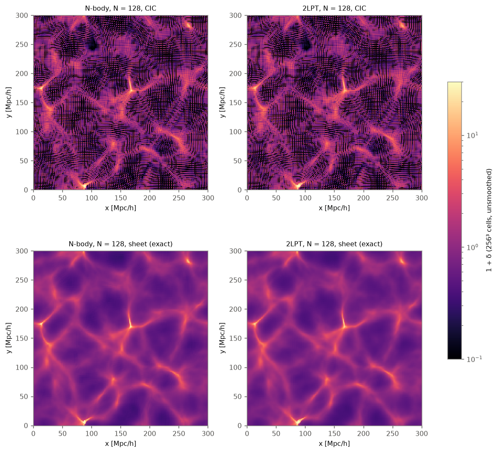
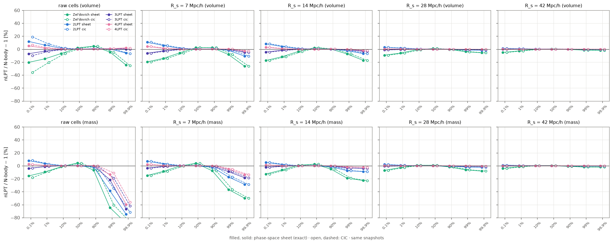
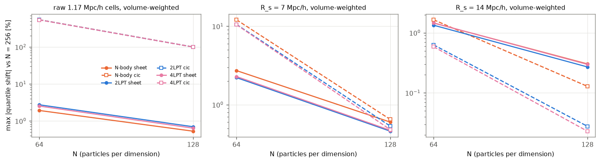
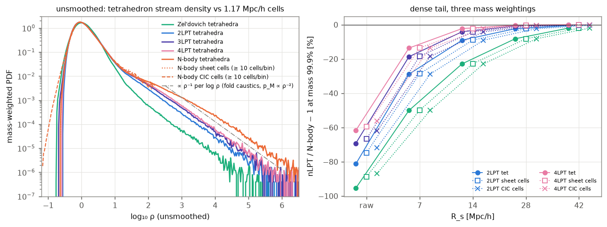

# Density PDFs with the phase-space-sheet estimator

This follows up the [one-point PDF study](../README.md). That study measured every PDF with a
particle (CIC) estimator. Here the same comparison, Zel'dovich through 4LPT against N-body, is
redone with the **phase-space sheet**, and every result sits next to the CIC value computed on the
same snapshot. Full tables: [`results/tables.md`](results/tables.md). Numbers in machine-readable
form: [`results/summary.json`](results/summary.json).

## Summary

1. **The first study's conclusions do not depend on the estimator.**
   - On smoothing scales R_s = 7–42 Mpc/h, the exact sheet density and CIC differ by ≤ 0.3% at every
     quantile, for every model.
   - The nLPT/N-body ratios agree to ≤ 0.2 percentage points. For example, at R_s = 7 Mpc/h the 2LPT
     volume-weighted 0.1% quantile is +10.7% (both estimators), and the mass-weighted 99.9% quantile
     is −28.9% (CIC) against −28.7% (sheet).
   - A third mass weighting, taken straight from the tetrahedra without any grid, agrees just as well.
2. **On unsmoothed cells the estimators differ strongly, and CIC is wrong in voids.**
   - With one particle per 1.17 Mpc/h cell, CIC leaves cells nearly empty: the lowest cell reaches
     1 + δ = 0.02–0.09, against 0.18–0.28 for the exact sheet.
   - The 0.1% volume quantile is 58–109% higher with the sheet, and the N-body cell variance differs
     by 30%.
   - At N = 128 CIC still has empty cells, while the sheet cell PDF has already converged to ≲ 1%.
3. **The sheet converges faster in voids and at small R_s; CIC converges faster at large R_s.**
   - At R_s = 7 Mpc/h, the largest 1–99% quantile shift at N = 64 is 2.2% (sheet) against 10.6% (CIC).
   - At R_s = 14 Mpc/h and N = 128 it is 0.27% (sheet) against 0.03% (CIC). Spreading each
     tetrahedron's mass uniformly over its volume smooths the particle field over one interparticle
     spacing Δq, which lowers the variance by O((kΔq)²): 0.1–0.4% at N = 256.
4. **The gridless mass weighting resolves the dense tail far beyond any mesh.**
   - The unsmoothed stream density of the equal-mass tetrahedra reaches 1 + δ = 647 at the N-body
     99.9% mass quantile. The same quantile is 158 from CIC cells and 209 from exact-sheet cells.
   - The tetrahedra continue to 10⁶ at the 99.9999% quantile.
   - Past about ρ = 10³ every model follows the fold-caustic law: the mass fraction above ρ falls as
     ρ⁻¹. Only the amplitude differs, set by the caustic mass. N-body reaches about 9× the density of
     2LPT, and about 4× that of 4LPT, at the same small mass fraction.
   - Even 4LPT is 62% short of N-body at the unsmoothed 99.9% quantile.
5. **The new snapshots reproduce the first study.**
   - These snapshots are DiscoDJNative LPT and its `run_nbody` port, on the same initial conditions.
   - CIC on them reproduces the original study-1 CIC quantiles to 0.00% for every LPT order.
   - For N-body the difference is ≤ 0.08%, between study 1's numpy KDK PM (100 steps) and BullFrog
     (64 steps).



*A 2.3 Mpc/h slab of the unsmoothed 256³ density at N = 128: CIC (top) and the exact sheet (bottom).
CIC shows the particle lattice as a moiré of empty and double-filled cells in underdense regions.*

## Method

| | |
|---|---|
| Snapshots | z = 0 displacements from DiscoDJNative on the study-1 initial conditions (same fixed-amplitude master phases; paired = θ + π): Zel'dovich, 2LPT, 3LPT, 4LPT (exact growth through 3rd order, EdS 4th) and N-body (`run_nbody`, BullFrog, 64 steps, PM mesh 2N). N = 64, 128, 256; the paired set at N = 256. |
| CIC | study 1's estimator unchanged: particles CIC-deposited on 256³, CIC window deconvolved |
| Exact sheet | every Lagrangian cube is split into DiscoDJNative's 6 Kuhn tetrahedra. A tetrahedron's mass Δq³/6 is spread uniformly over its volume \|V_T\| (streams add; inverted tetrahedra count with \|V_T\|) and goes into each cell in proportion to the **exact overlap volume**, computed by [R3D](https://github.com/yipihey/r3djl) (r3d clipping and voxelization; `sheet_deposit.jl`). Mass is conserved to 10⁻¹¹. Before smoothing, only the cell-average (pixel) window is deconvolved. |
| Tetrahedron mass weighting | every tetrahedron has the same mass, so an equal-weight sample over tetrahedra is mass-weighted with no gridded weights (`tet_mass_pdf.jl`). Unsmoothed: the stream density (Δq³/6)/\|V_T\|. Smoothed: the smoothed exact-sheet field interpolated to each tetrahedron's centroid. |
| Statistics | as in study 1: top-hat R_s = 7, 14, 28, 42 Mpc/h; volume weighting counts cells equally; gridded mass weighting counts each cell by its deposited mass; quantiles 0.1–99.9%. R_s = 0 means raw 1.17 Mpc/h cells, reported as a diagnostic. |

Tests (`test_sheet_deposit.jl`, 22 pass):
- a uniform or shifted lattice gives ρ = 1 to round-off;
- mass is conserved and ρ ≥ 0 in a strongly shell-crossed flow;
- the exact cell averages are the limit of point-sampled averages, whose difference falls about
  2.8× per halving of the sampling step;
- the tetrahedron sampler is exact for a uniform lattice and a constant field.

## Results

### nLPT / N-body − 1, both estimators (N = 256)

| R_s | model | estimator | σ² | vol 0.1% | vol 99.9% | mass 99% | mass 99.9% |
|---:|---|---|---:|---:|---:|---:|---:|
| 7 | 2LPT | CIC | −9.4% | +10.7% | −10.7% | −17.3% | −28.9% |
| 7 | 2LPT | sheet | −9.4% | +10.7% | −10.8% | −17.3% | −28.7% |
| 7 | 2LPT | sheet, paired | −10.2% | +9.8% | −10.5% | −17.7% | −28.1% |
| 7 | 4LPT | CIC | −2.5% | +4.2% | −2.7% | −5.3% | −13.6% |
| 7 | 4LPT | sheet | −2.5% | +4.2% | −2.9% | −5.1% | −13.6% |
| 14 | 2LPT | CIC | −4.9% | +8.3% | −6.9% | −7.5% | −9.1% |
| 14 | 2LPT | sheet | −4.9% | +8.3% | −6.9% | −7.5% | −9.0% |
| 14 | 4LPT | CIC | −0.9% | +2.8% | −2.0% | −1.8% | −2.4% |
| 14 | 4LPT | sheet | −0.9% | +2.8% | −2.0% | −1.8% | −2.3% |
| raw | 2LPT | CIC | −45.9% | +18.8% | −6.9% | −34.7% | −71.9% |
| raw | 2LPT | sheet | −56.6% | +11.9% | −6.1% | −38.7% | −74.8% |
| raw | 4LPT | CIC | −32.1% | +6.5% | +1.7% | −11.2% | −56.3% |
| raw | 4LPT | sheet | −43.4% | +5.0% | +2.1% | −13.5% | −59.7% |

The tetrahedron mass weighting gives the same mass-weighted ratios at R_s ≥ 7, within 0.2
percentage points (for example −28.9% for 2LPT at the 99.9% quantile, R_s = 7). Unsmoothed, it gives
−81% (2LPT) and −62% (4LPT) at the 99.9% quantile.



*nLPT / N-body − 1 at fixed quantiles, exact sheet (filled) and CIC (open), on the same snapshots.
Top volume-weighted, bottom mass-weighted; the first column is the raw 1.17 Mpc/h cells.*

### Resolution convergence

Largest 1–99% quantile shift against N = 256 (volume / mass-weighted):

| model | R_s | estimator | N = 64 | N = 128 |
|---|---:|---|---:|---:|
| N-body | raw | CIC | 546% / 1489% | 100% / 131% |
| N-body | raw | sheet | 1.9% / 35% | 0.53% / 9.1% |
| N-body | 7 | CIC | 12.1% / 10.0% | 0.65% / 1.75% |
| N-body | 7 | sheet | 2.7% / 7.8% | 0.60% / 1.55% |
| N-body | 14 | CIC | 1.65% / 1.63% | 0.13% / 0.27% |
| N-body | 14 | sheet | 1.45% / 2.65% | 0.30% / 0.51% |
| 2LPT | 7 | CIC | 10.6% / 7.9% | 0.53% / 1.37% |
| 2LPT | 7 | sheet | 2.2% / 4.2% | 0.46% / 0.83% |
| 2LPT | 14 | CIC | 0.63% / 0.60% | 0.03% / 0.03% |
| 2LPT | 14 | sheet | 1.34% / 1.55% | 0.27% / 0.32% |



### The dense tail from the tetrahedra



*Left: the unsmoothed mass-weighted PDF of the tetrahedron stream density (N = 256), with the
N-body cell estimators for comparison. The dash-dotted line is the fold-caustic slope. Right:
nLPT/N-body − 1 at the 99.9% mass quantile for three mass weightings, against R_s.*

Mass-weighted quantiles 1 − 10⁻ᵏ of the unsmoothed tetrahedron stream density (N = 256; the
"inverted" column is the shell-crossed mass fraction):

| model | inverted | 99.9% | 99.99% | 99.999% | 99.9999% |
|---|---:|---:|---:|---:|---:|
| Zel'dovich | 0.03% | 30 | 235 | 2.5 × 10³ | 2.2 × 10⁴ |
| 2LPT | 0.19% | 121 | 1.2 × 10³ | 1.2 × 10⁴ | 1.5 × 10⁵ |
| 3LPT | 0.30% | 199 | 2.1 × 10³ | 2.1 × 10⁴ | 2.0 × 10⁵ |
| 4LPT | 0.36% | 248 | 2.6 × 10³ | 2.8 × 10⁴ | 2.6 × 10⁵ |
| N-body | 0.45% | 647 | 1.1 × 10⁴ | 1.1 × 10⁵ | 1.2 × 10⁶ |
| N-body, paired | 0.56% | 780 | 1.1 × 10⁴ | 1.1 × 10⁵ | 1.2 × 10⁶ |

- **The tail is caustic-dominated.** Each decade in mass fraction adds a decade in density, so the
  mass fraction above ρ falls as ρ⁻¹. This is the mass-weighted form of the fold-caustic law
  p_V ∝ ρ⁻³.
- **The inverted fractions match study 1.** They reproduce its shell-crossed mass fractions (0.035,
  0.19, 0.31, 0.38 and 0.52%), and the tail amplitude follows them.
- **The unsmoothed 99.9% quantile is converging with N.** For N-body it goes 303, 582, 647 at
  N = 64, 128, 256; for the LPT orders it is within 4% at N = 128.
- **The maxima are not converged.** They reach 10⁷–10⁸, where tetrahedra degenerate at caustics.

## Reproduce

```
cd studies/lpt_pdf/sheet_pdf
julia -t auto --project=. test_sheet_deposit.jl     # estimator tests
./run_all.sh     # snapshots, both estimators, statistics, tetrahedra, tables, figures (resumable)
```

Notes:
- `Project.toml` takes R3D from GitHub via `[sources]`.
- The paired-phase snapshots at N = 256 need the memory-lean nLPT kernels (`DJN_MODE=lean`) to fit
  in 15 GB.
- The snapshots live in `_scratch/copula` and are shared with the copula study.
